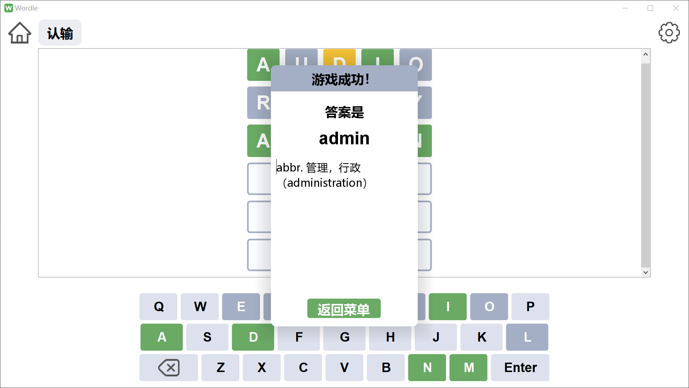
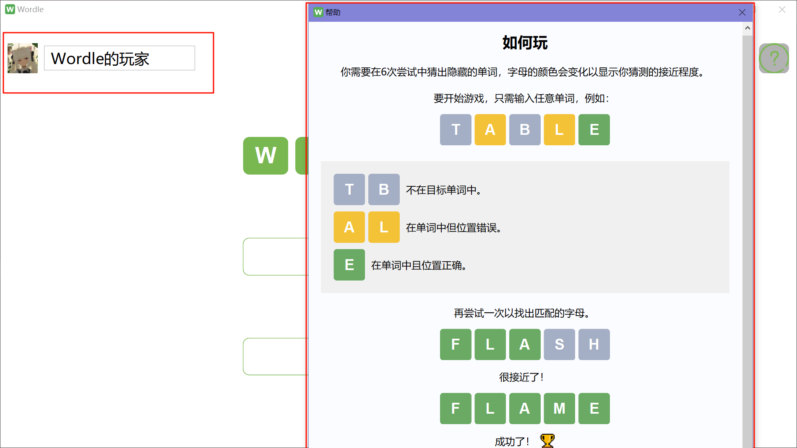
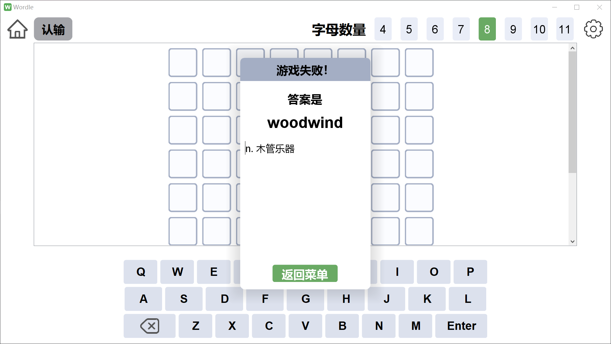
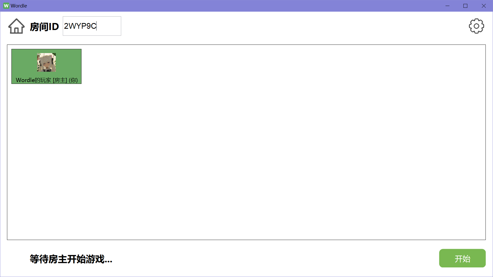
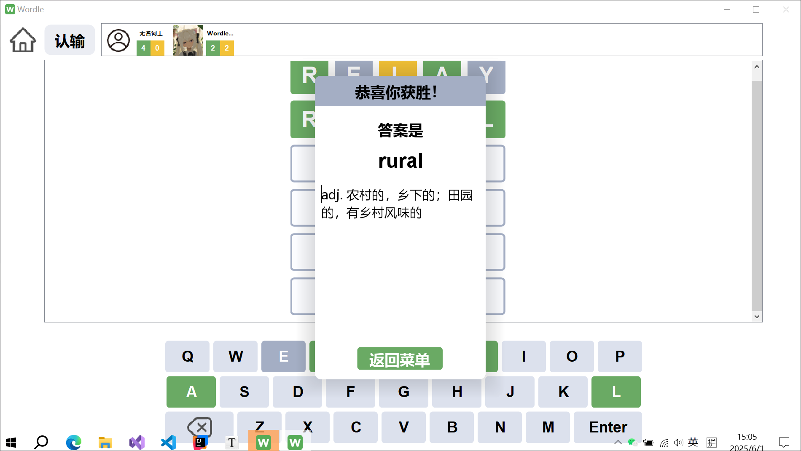
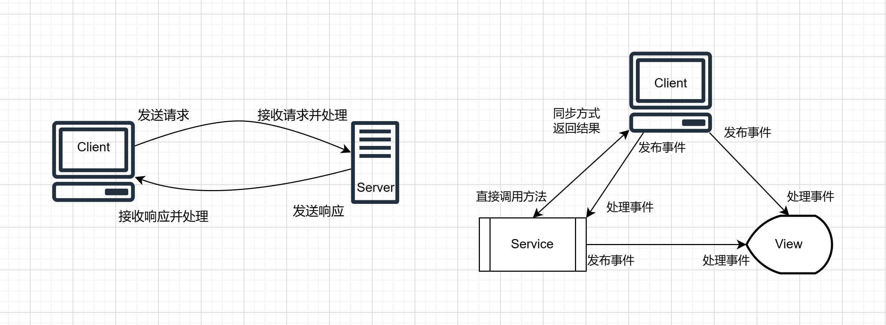
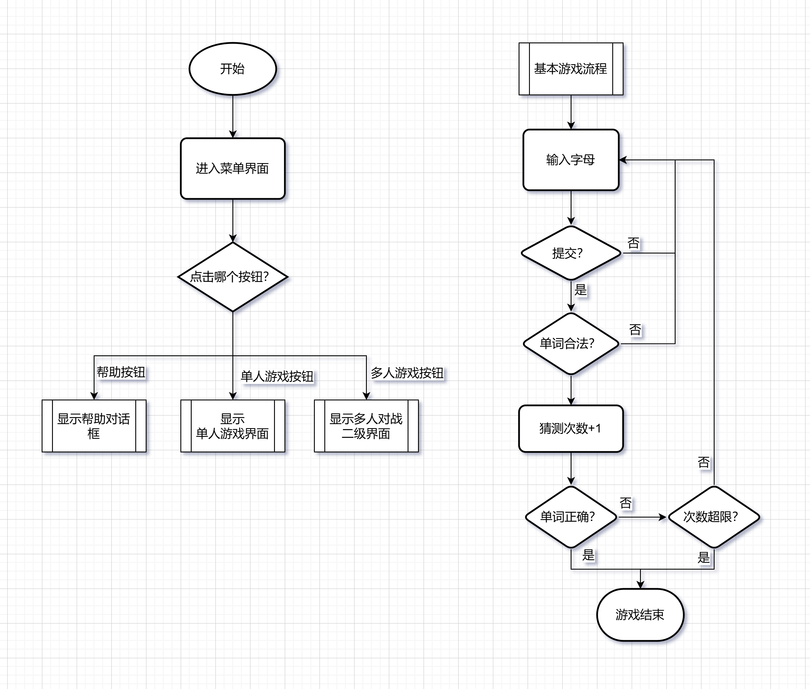

# Wordle 游戏 🎮

[](https://www.oracle.com/java/)
[](LICENSE.md)
[](https://github.com/njdldkl666699/Wordle/stargazers)

基于 Java Swing 开发的经典 Wordle 单词猜谜游戏，支持单人和多人对战模式。



## 📝 游戏介绍

Wordle 是一款文字猜谜游戏，玩家需要在有限次数内猜出一个单词。本项目基于经典 Wordle 游戏设计：

- **玩家目标**：在有限猜测次数内（字母数+1 次）猜出正确的单词
- **游戏反馈**：
  - **绿色方块 🟩**：字母正确且位置正确
  - **黄色方块 🟨**：字母正确但位置错误
  - **灰色方块 ⬜**：字母不在答案中

### ✨ 特色功能：

- 支持单人游戏和多人对战
- 可调整单词字母数量（4-11 个字母）
- 在线多人竞速模式
- 简洁直观的界面设计
- 丰富的单词库，支持不同难度级别

## 🖼️ 功能展示

### 菜单界面



### 单人游戏



### 多人游戏




## 🔨 构建与运行

### 环境要求

- JDK 21 或更高版本
- Maven 3.8.0+
- 构建环境：IntelliJ IDEA 2025.1.1.1（推荐，含 Swing UI Designer 插件）

### 构建步骤

1. 克隆项目到本地

   ```bash
   git clone https://github.com/njdldkl666699/Wordle.git
   ```

2. 安装 UI 设计器插件依赖

   - 克隆`ideauidesigner-maven-plugin`项目到本地

   ```bash
   git clone https://github.com/njdldkl666699/ideauidesigner-maven-plugin.git
   ```

   - 打开`ideauidesigner-maven-plugin`项目
   - 运行`install-intellij-libs.bat`安装 javac2.jar 等依赖到本地 Maven 仓库
   - 执行`mvn install`安装插件到本地 Maven 仓库

3. 构建和打包应用

   ```bash
   cd Wordle
   mvn clean package
   ```

4. 运行

   - 可执行程序位于`target/bin`目录下

## 🎮 游戏玩法

1. 从主菜单选择游戏模式（单人或多人）
2. 在单人模式中，选择单词长度（4-11 个字母）
3. 在多人模式中，创建或加入游戏房间
4. 输入单词猜测并提交
5. 根据色块反馈调整策略，直到猜中正确单词

## 🔧 技术实现

### 架构设计

游戏采用分层架构设计：

- **UI 层**：Java Swing 实现的用户界面
- **Service 层**：游戏逻辑处理
- **Client/Server 层**：多人游戏网络通信

### 关键技术

1. **UI 设计**：Java Swing + IDEA UI Designer 实现界面设计
2. **数据处理**：使用 fastjson2 解析和管理单词库
3. **网络通信**：
   - 基于 TCP 的客户端-服务器架构
   - JSON 序列化实现数据传输
   - 请求-响应消息封装
4. **通信机制**：
   - 层间采用 Guava EventBus 实现事件驱动通信
   - 同步/异步请求处理
   - 单播/广播消息分发

### 通信架构



### 游戏流程



## 📁 项目结构

```
Wordle/
├── src/
│   ├── main/
│   │   ├── java/        # 源代码
│   │   └── resources/   # 资源文件和配置
│   └── test/            # 单元测试
├── log/                 # 日志文件
├── tools/               # 工具脚本
├── target/              # 构建输出目录
├── img/                 # 本文档所用截图
├── pom.xml              # Maven配置
├── LICENSE.md           # 许可证文件
└── README.md            # 项目说明
```

## 🤝 项目贡献与联系方式

作者：[njdldkl666699](https://github.com/njdldkl666699)

欢迎通过以下方式联系或贡献：

- 提交[Issue](https://github.com/njdldkl666699/Wordle/issues)或[Pull Request](https://github.com/njdldkl666699/Wordle/pulls)
- 联系邮箱：2312454@mail.nankai.edu.cn

## 📚 相关链接

- [Wordle Game - Play Unlimited](https://wordly.org/)
- [项目源码库](https://github.com/njdldkl666699/Wordle)
- [UI 设计器插件](https://github.com/njdldkl666699/ideauidesigner-maven-plugin)
- [单词数据来源](https://github.com/arstgit/high-frequency-vocabulary)

## 📄 许可证

本项目基于 MIT 许可证 - 查看 [LICENSE.md](LICENSE.md) 了解详情
